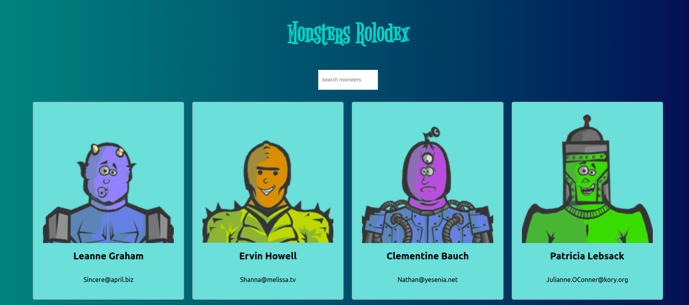

# Monsters Rolodex

> This project was bootstrapped with [Create React App](https://github.com/facebook/create-react-app).

<br>

This is a simple project to start practicing `React` basic key concepts.



## How to run this project (locally)

Once you have your environment set up (with `NodeJS` and `NPM` installed), just open this folder in a terminal instance and run this command: 

```sh
npm start
```

A new browser window should open up with the app running. If, by any chance, it doesn't happen, just open your browser and access localhost at port 3000:

```sh
http://localhost:3000/
```

and this should do. 

> **p.s.:** Do not forget to install all package dependencies by runing `npm install` or `yarn`.